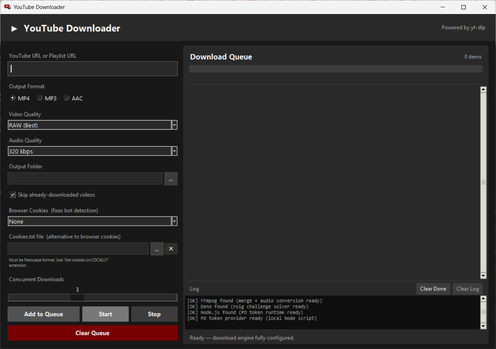

# YouTubeDL - YouTube URL Downloader

A cross-platform desktop application for downloading YouTube videos and playlists
as **MP4**, **MP3**, or **AAC** with quality selection and batch support. Built with
Python, tkinter, and yt-dlp, with a full modern anti-bot stack (PO Token provider +
Deno nsig solver) so it keeps working against current YouTube protections.

---

## Features

- Single video or full playlist download from any YouTube URL
- Output formats: **MP4** (video) · **MP3**, **AAC** (audio-only)
- Video quality: RAW (best available), 1080p, 720p, 480p, 360p
- Audio quality: 320 kbps, 256 kbps, 192 kbps, 128 kbps
- Concurrent downloads (1–6 parallel workers, configurable)
- Live per-item **and** overall progress bars, plus a scrolling log panel
- Per-item **delete** (🗑) button, **Clear Done**, and duplicate-queue protection
- Resume support — already-downloaded videos are skipped *only if the file still
  exists on disk* (`storage/history.db`)
- Honest status reporting — a download is marked **Completed only if the output
  file is verified on disk**, otherwise **Failed** with the real error
- Browser-cookie and `cookies.txt` support (with Netscape-format validation)
- Automatic cleanup of intermediate stream fragments (concurrency-safe)
- Dark-themed modern GUI, no external UI framework — pure tkinter
- Cross-platform icon (window + taskbar) on Windows, macOS, Linux

---

## How it works (architecture)

```
                ┌──────────────────────────────────────────────┐
                │                  app.py (tkinter GUI)          │
                │  • queue view, progress bars, log panel        │
                │  • runtime.setup() on launch (checks stack)    │
                └───────────────┬──────────────────────────────┘
                                │
        ┌───────────────────────┼───────────────────────────┐
        ▼                       ▼                            ▼
 downloader/playlist.py   downloader/queue.py        downloader/download.py
  extract metadata        ThreadPoolExecutor          per-video yt-dlp download
  (extract_flat)          (1–6 workers)               + retry + verify-on-disk
        │                       │                            │
        └───────────────────────┴───────────────────────────┘
                                │
                 ┌──────────────┴───────────────┐
                 ▼                               ▼
          storage/db.py                   downloader/runtime.py
       SQLite history +                FFmpeg / Deno / Node /
       file-existence check            PO-token script + PATH setup
```

The download engine (`yt-dlp`) depends on four external pieces — **FFmpeg**, **Deno**,
**Node.js**, and the **local PO-token script** — all set up automatically by the
deploy script and verified at app startup (logged as `[OK]`/`[!!]`).

---

## Requirements

| Dependency | Version | Purpose | Installed by |
|------------|---------|---------|--------------|
| Python     | 3.10+   | Runtime | you |
| yt-dlp     | 2025.1+ | Download engine | deploy script (pip) |
| FFmpeg     | Any     | Merge video+audio, MP3/AAC conversion | deploy script (winget) |
| Deno       | Any     | Solves YouTube's "n" signature challenge (nsig) | deploy script |
| Node.js    | ≥20.19  | Runs the local PO Token script | deploy script |
| bgutil-ytdlp-pot-provider | ==1.3.1 | yt-dlp plugin → fetches PO Tokens | deploy script (pip) |
| yt-dlp-ejs | 0.8+    | JS challenge solver distribution (uses Deno) | deploy script (pip) |
| tkinter    | Bundled | GUI | included with Python |

> The PO Token provider runs as a local Node.js script built into
> `pot-provider/server/` by the deploy script (bgutil "script mode").

### Why Deno, Node and a token provider?

Since 2024–2025 YouTube enforces protections that **plain yt-dlp cannot satisfy
on its own**. This app bundles the full workaround stack, all running locally:

- **PO Tokens (Proof-of-Origin)** — required for authenticated / bot-gated videos.
  Without one, authenticated requests receive **zero media formats** (only
  storyboards). Supplied by the `bgutil-ytdlp-pot-provider` plugin in **script
  mode**: yt-dlp invokes a local Node.js script
  (`pot-provider/server/build/generate_once.js`) on demand — no background server.
- **nsig challenge** — YouTube obfuscates stream URLs with a JavaScript "n"
  parameter that must be executed, or the URLs are throttled/invalid. Solved by
  `yt-dlp-ejs` using the **Deno** runtime. Symptom when missing:
  *"Requested format is not available."*
- **FFmpeg** — `bestvideo+bestaudio` come as separate streams that must be merged
  into a single MP4. Missing FFmpeg = no output file at all.

On launch the app runs `downloader/runtime.py`, which puts FFmpeg, Deno and Node
on PATH, verifies the local PO token script, then logs `[OK]` / `[!!]` for each.
See [debug/troubleshooting.md](debug/troubleshooting.md) for the full breakdown.

> **Note on the two JS runtimes:** Deno handles the nsig challenge; Node runs the
> PO token script. The deploy keeps only the provider's compiled `build/` output
> (not `src/`), which makes the plugin use the Node provider instead of its Deno
> one (the Deno variant can't load the provider's native `canvas` dependency).

---

## Quick Start

### Windows

```powershell
# PowerShell (recommended): FFmpeg, Deno, Node (winget) + builds the PO provider
# + creates venv + installs all pip deps.
Set-ExecutionPolicy -Scope Process Bypass
.\deploy.ps1

# Command Prompt: same full install via winget + powershell (PS1 is still preferred).
deploy.bat
```

After deployment, launch with the headless launcher (no console window) or directly:

```powershell
.\app.bat                       # headless launcher (recommended)
.\venv\Scripts\python.exe app.py
```

### Linux / macOS

```bash
chmod +x deploy.sh app.sh
./deploy.sh          # installs ffmpeg, deno, node, python3-tk (Linux), builds PO provider
./app.sh             # headless launcher
```

> The deploy scripts are idempotent — safe to re-run. They detect already-installed
> components and only add what is missing. **Close the app before re-running** (an
> open instance locks the `venv`).

### What the deploy installs (and where)

A single run of `deploy.ps1` / `deploy.bat` / `deploy.sh` installs **everything** —
project dependencies go into project-local subdirectories:

| Goes where | What | How |
|------------|------|-----|
| **`venv/`** (project) | Python deps: `yt-dlp`, `requests`, `bgutil-ytdlp-pot-provider`, `yt-dlp-ejs` | `python -m venv` + `pip install -r requirements.txt` |
| **`pot-provider/server/node_modules/`** (project) | Node deps for the PO-token script | clone bgutil 1.3.1 → `npm install` → `npx tsc` |
| System (PATH) | **FFmpeg**, **Deno**, **Node.js** runtimes | winget (Windows) · apt/brew (Linux/macOS) |

The two project-local trees (`venv/` and `pot-provider/server/node_modules/`) are
**self-contained** — delete them and re-run the deploy to rebuild from scratch.
The three runtimes are shared system tools (they can't live inside the project), but
the app locates them automatically at startup via `downloader/runtime.py`.

---

## Manual component setup (if the deploy script can't)

**FFmpeg**
- Windows: `winget install Gyan.FFmpeg` (or static build from [ffmpeg.org](https://ffmpeg.org/download.html) added to PATH)
- macOS: `brew install ffmpeg`
- Ubuntu/Debian: `sudo apt install ffmpeg`

**Deno** (nsig solver)
- Windows: `irm https://deno.land/install.ps1 | iex`
- macOS/Linux: `curl -fsSL https://deno.land/install.sh | sh`

**Node.js ≥20.19** (PO token script runtime)
- Windows: `winget install OpenJS.NodeJS.LTS`
- macOS: `brew install node` · Ubuntu/Debian: NodeSource `setup_lts.x`

**PO Token provider** (local Node script)
```bash
# Build it manually (the deploy script does this for you):
git clone --depth 1 --branch 1.3.1 \
  https://github.com/Brainicism/bgutil-ytdlp-pot-provider.git /tmp/bgutil
cd /tmp/bgutil/server && npm install && npx tsc
# Keep only build/ + node_modules/ (drop src/ so the Node provider is used):
mkdir -p <project>/pot-provider/server
mv build node_modules package.json <project>/pot-provider/server/
```

---

## Project Structure

```
YouTube Playlist Downloader/
├── app.py                   # GUI entry point (tkinter)
├── app.bat / app.sh         # Headless launchers (run via venv, no console)
├── requirements.txt
├── deploy.ps1               # Windows PowerShell deployer (full stack)
├── deploy.bat               # Windows cmd fallback deployer
├── deploy.sh                # Linux/macOS one-shot deployer
│
├── assets/
│   ├── icon.png             # Application icon (window, taskbar)
│   └── icon.ico             # Windows taskbar icon (shipped, not generated)
│
├── models/
│   └── task.py              # VideoTask dataclass + format/quality enums
│
├── downloader/
│   ├── runtime.py           # FFmpeg/Deno/Node/PO-provider discovery + checks
│   ├── playlist.py          # Playlist/video metadata extraction (+ cookies)
│   ├── download.py          # Per-video yt-dlp download, retry, verify-on-disk
│   └── queue.py             # Concurrent ThreadPoolExecutor download queue
│
├── pot-provider/            # Local PO Token provider (Node script, built by deploy)
│   └── server/
│       ├── build/generate_once.js   # Node script yt-dlp invokes for PO tokens
│       └── node_modules/            # its dependencies
│
├── storage/
│   ├── db.py                # SQLite resume/history database
│   └── history.db           # Auto-created download history (video_id + path)
│
├── processors/              # Reserved for future post-processing hooks
├── downloads/               # Default output directory (flat, no subfolders)
├── venv/                    # Virtual environment (created by deploy)
│
├── logs/
│   └── changelog.md
└── debug/
    └── troubleshooting.md
```

---

## Usage Guide

1. **Paste a URL** — single video (`https://youtube.com/watch?v=...`) or playlist
   (`https://youtube.com/playlist?list=...`).
2. **Select format** — MP4 (video) or MP3 / AAC (audio-only).
3. **Select quality** — video resolution or audio bitrate.
4. **Choose output folder** — defaults to `downloads/` inside the project.
5. **(If needed) Cookies** — for bot-gated or age-restricted videos, pick a
   `cookies.txt` (Netscape format) or a browser in the cookie dropdown.
6. **Click "Add to Queue"** — the app fetches the YouTube URL info (single video or
   full playlist) and lists each item.
7. **Click "Start"** — concurrent downloads begin; per-item and overall progress
   bars update live, and the log shows ✓ / ✗ per video.
8. **Manage the queue** — 🗑 removes a single item (no confirmation), **Clear Done**
   prunes finished rows, **Clear Queue** wipes everything, **Stop** halts downloads.

> Tip: **"Skip already-downloaded videos"** lets you re-run the same playlist URL
> and only fetch new additions. It re-downloads anything whose file was deleted.

> Cookies tip: a `cookies.txt` must be a **complete signed-in export** — it needs
> `SID`, `SAPISID`, `LOGIN_INFO`, etc. A partial export (only the `__Secure-3P*`
> cookies) is *not* treated as logged in and the bot gate will still trigger. The
> most reliable method: sign into YouTube in a **private/incognito** window, export
> with "Get cookies.txt LOCALLY", then close the window immediately.

---

## Configuration

All everyday settings are in the GUI. For advanced yt-dlp options, edit
`downloader/download.py` → `_build_ydl_opts()`.

Current download defaults:

| Option | Value | Note |
|--------|-------|------|
| `format` (video) | `bestvideo+bestaudio/best` | merged to MP4 via FFmpeg |
| `merge_output_format` | `mp4` | |
| `ignoreerrors` | **False** | so real failures are reported, not hidden |
| `retries` / `fragment_retries` | 5 | |
| `concurrent_fragment_downloads` | 4 | per video |
| Download attempts | 3 | with exponential backoff |
| Success criterion | **output file exists on disk** | prevents false "Completed" |

---

## Known limitations

These are **YouTube-side restrictions**, not bugs in this app:

- **DRM-protected media cannot be downloaded.** Purchased/rented TV shows and
  movies are Widevine-encrypted. They fail with `This video is DRM protected`
  **even when using the cookies of the account that bought them** — ownership does
  not remove the encryption. There is no workaround in yt-dlp.
- **Age-restricted (18+) videos usually fail** with "Sign in to confirm you're not
  a bot" — and in testing this happened **even with cookies from an age-verified
  18+ account**. YouTube's extra age-gate verification isn't satisfied by account
  cookies alone.
- **IP rate-limiting / bot-detection.** Heavy use (many rapid requests) can cause
  YouTube to challenge *all* anonymous requests from your IP. It is time-based and
  clears on its own (a few hours; reliably overnight). Workarounds: provide cookies,
  reduce concurrency, or wait. See [debug/troubleshooting.md](debug/troubleshooting.md).
- **SABR-forced videos.** YouTube is rolling out SABR-only streaming for some
  videos/clients; yt-dlp's support is still experimental and such videos may not
  be downloadable yet.
- The PO Token provider runs as a **local Node.js script**. It needs
  Node ≥20.19 and the built `pot-provider/server` (created by the deploy script).

> The app works fully for **standard public videos and playlists** (the common
> case). The limitations above apply only to encrypted or age-gated content.

---

## License

MIT — use freely, attribution appreciated.

---

## Screenshots

### YouTubeDL Application GUI
